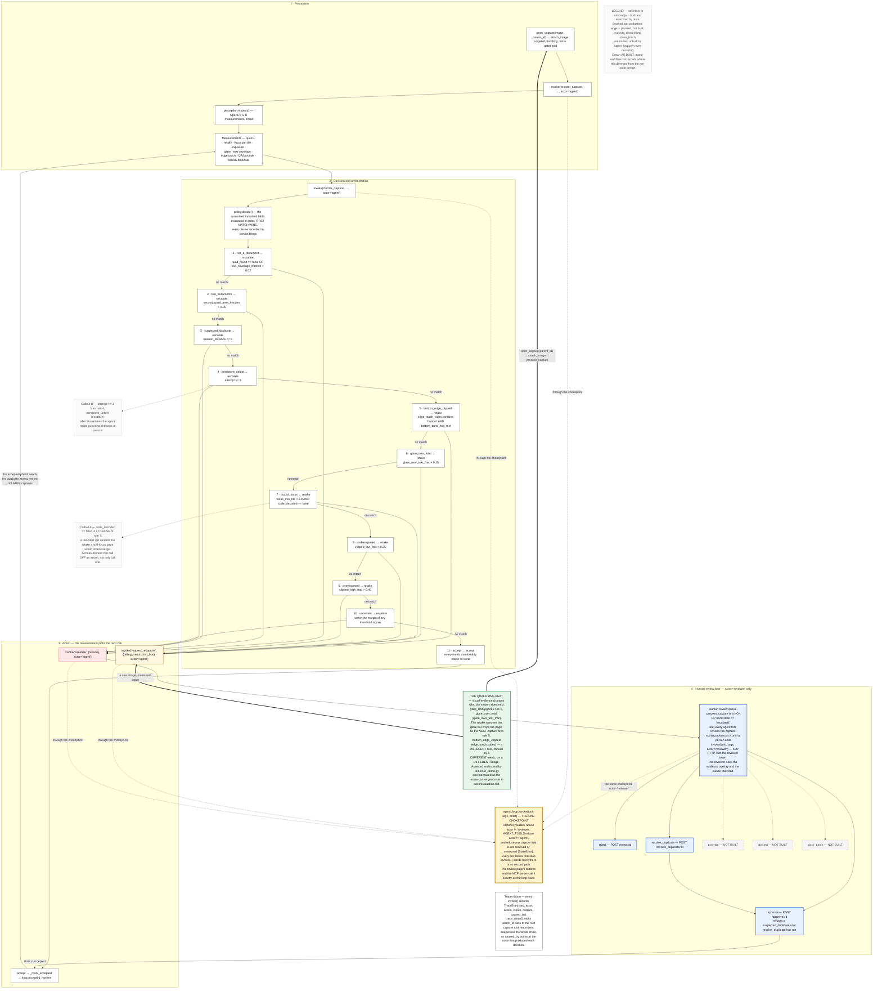

# Second Look — agent workflow

The diagram the Agentic Vision Award asks for: "An agent workflow diagram showing
perception, decision or orchestration, and action."

- Source: [`agent-workflow.mmd`](./agent-workflow.mmd) (Mermaid)
- Exported image: [`agent-workflow.svg`](./agent-workflow.svg)

It is drawn as a **cycle, not a pipeline**. Two edges close the loop — the retake edge back
into perception, and the accept edge that seeds the duplicate measurement of later captures
— and those loop-backs are the qualifying claim, not decoration.

## Legend

**Solid box or solid edge = built and exercised by tests. Dashed box or dashed edge =
planned, not built.** `override`, `discard` and `close_batch` are drawn dashed because
`agent_loop.py`'s own module docstring names them as not implemented. The heavily outlined
box is `agent_loop.invoke(tool, args, actor)` — every lane's calls land there.



## 1 · Perception

`open_capture(image, parent_id)` and `attach_image` are deliberately ungated plumbing — they
create a slot and put bytes in it, and mutate nothing a verdict depends on except the retake
`attempt` counter, derived from `parent_id` rather than caller-supplied. The first gated
call is `invoke("inspect_capture", …, actor="agent")`, which runs `perception.inspect()`:
rectify first, then focus per tile, exposure, glare, text coverage, frame-edge crop,
QR/barcode and the perceptual hash, each timed into `elapsed_ms`. The output is one frozen
`Measurements` record of numbers, flags and box coordinates. No pixels and no decoded text
travel any further.

## 2 · Decision and orchestration

`invoke("decide_capture", …, actor="agent")` runs `policy.decide()` against
`src/secondlook/policy.toml` — a committed threshold table, no model and no randomness. The
cascade is drawn as an ordered ladder because **its order is the policy**: rules are
evaluated top to bottom and the first match wins. Escalating rules sit above retake rules on
purpose, so "this is not a receipt" or "I have seen this receipt already" beats "the light
was bad". Every clause evaluated — matched or not — is recorded in `verdict.firings`, which
is what makes a verdict auditable after the fact.

Rule 10, `uncertain`, is the safety valve: a capture that lands within a margin of any
threshold above goes to a person rather than being resolved by a hair's width. Rule 11 only
accepts when everything is comfortably inside its band.

## 3 · Action

The verdict picks exactly one next call, and the edge into it is labelled with the metric
that chose it:

| Rule | Metric that fired it | Next call |
|---|---|---|
| `bottom_edge_clipped` | `edge_touch_sides` (+ `bottom_band_has_text`) | `request_recapture` |
| `glare_over_total` | `glare_over_text_frac` | `request_recapture` |
| `out_of_focus` | `focus_min_tile` (unless `code_decoded`) | `request_recapture` |
| `underexposed` | `clipped_low_frac` | `request_recapture` |
| `overexposed` | `clipped_high_frac` | `request_recapture` |
| `not_a_document`, `two_documents`, `suspected_duplicate`, `persistent_defect`, `uncertain` | `quad_found` / `text_coverage_fraction`, `second_quad_area_fraction`, `nearest_distance`, `attempt`, any margin | `escalate` |
| `accept` | all of them, comfortably | `_mark_accepted` |

`process_capture` makes those calls itself — a person does not, and neither does a test
script. `request_recapture` names the one failing metric and the hint box for the region it
failed in, opens a successor capture with `parent_id` set, and the loop starts again on the
new image.

Two callouts on the diagram are worth reading twice. **Callout A**: `code_decoded == false`
is a *clause* of `out_of_focus`, so a decoded QR code cancels a retake that a soft-focus page
would otherwise have been asked for — a measurement calling an action *off*. **Callout B**:
`attempt >= 3` fires `persistent_defect` and escalates, so after two retakes the agent stops
guessing and hands the capture to a person.

## 4 · Human review lane

An escalated capture stops moving. `process_capture` returns immediately once
`state == "escalated"`, and every agent tool raises `StateError` for a capture that is not
`received` or `measured` — so neither the loop nor an agent calling its tools directly can
re-decide it, request a retake of it or move it anywhere. Nothing advances it until a person
calls `invoke(verb, …, actor="reviewer")`. This is a mechanism, not a promise: there is no
timer that eventually auto-approves and no agent path that reaches the accepted state.
`tests/test_agent_loop.py` replays the escape that the state guard closes (re-decide the
escalated capture, then request a retake of it) and asserts every agent tool is refused.

The guard that enforces it lives in `invoke()` itself:

```python
if tool in HUMAN_VERBS and actor != "reviewer":
    raise PermissionError(f"{tool!r} is human-only; actor was {actor!r}")
if tool in AGENT_TOOLS and actor != "agent":
    raise PermissionError(f"{tool!r} is an agent tool; actor was {actor!r}")
```

`approve`, `reject` and `resolve_duplicate` are built, each with an HTTP route and a button
on the review page, which shows the reviewer the evidence overlay and the clause that fired.
Over HTTP those routes need the reviewer token (`Authorization: Bearer …`) and answer `401`
without it. `override`, `discard` and `close_batch` are drawn dashed because they are not
built. One extra ordering rule is drawn in:
`approve` **refuses** a capture escalated as `suspected_duplicate` until `resolve_duplicate`
has run, so a person cannot wave a possible duplicate through in one click.

## The qualifying beat

The award's own words: "the visual evidence must change what the system does next". Here is
the exact beat, and it is asserted end to end by
[`tools/run_demo.py`](../tools/run_demo.py):

1. `glare_text.jpg` is measured. `glare_over_text_frac` is over 0.15, so rule 6,
   `glare_over_total`, fires. Outcome: **retake**, with the failing metric
   `glare_over_text_frac` and a hint box over the glare.
2. The retake arrives — `crop_bottom.jpg`, the same underlying receipt, the light moved. The
   glare is gone. `glare_over_text_frac` no longer fires.
3. But the new framing clipped the page: `edge_touch_sides` contains `bottom` and the bottom
   band has text, so rule 5, `bottom_edge_clipped`, fires. Outcome: **retake** again — from a
   **different rule**, chosen by a **different metric**, on a **different image**.
4. `clean_a.jpg` arrives and rule 11 accepts it.

Nothing about step 3 was scheduled. It is the second image's own measurements selecting the
second instruction; had the retake been clean, rule 11 would have accepted it instead — and
that is exactly what the third step shows.

`docs/evaluation.md` measures this as its **retake-convergence sequence set**: six scripted
sequences, of which the `glare_text → crop_bottom → clean_a` chain converges in 2 retakes,
and the deliberately unfixable `blur_4 → blur_4 → blur_4` chain correctly does *not*
converge — it escalates as `persistent_defect` on the third decision. Convergence overall:
**5/6 (83.3%)**.

## Where this diverges from the pre-code design

The workflow diagram's outline was written before the loop existed, as part of the entry's
design notes (not published in this repository). Two of its prescriptions are drawn
differently here, and the reason is accuracy rather than preference:

- The outline asks for a human review lane containing all six human-only verbs. Only three
  are built. All six appear, but `override`, `discard` and `close_batch` are dashed and
  labelled NOT BUILT.
- The outline's perception node is `inspect_capture` with the eight metrics drawn as a
  bundle; as built, the ungated `open_capture` / `attach_image` plumbing sits before it and
  is drawn, because otherwise the loop-back edge has nowhere to land.

The outline is left unrevised on purpose — it is the record of the pre-implementation
intention. See [`architecture.md`](./architecture.md#where-this-diverges-from-the-pre-code-design)
for the same treatment of the architecture diagram.
