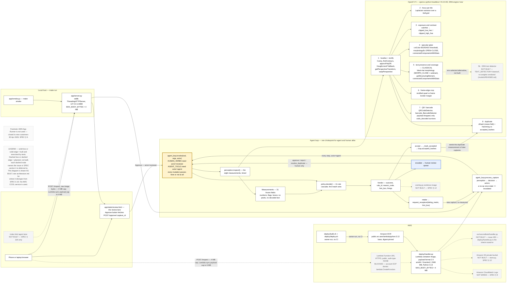

# Second Look — architecture

The diagram the OpenCV AI Competition rules ask for: "An architecture diagram showing the
OpenCV 5 and AWS components and, where relevant, COOL or agent components."

- Source: [`architecture.mmd`](./architecture.mmd) (Mermaid)
- Exported image: [`architecture.svg`](./architecture.svg)

**No AWS COOL service is used by this entry**, so nothing COOL appears on the diagram. The
agent components — the `invoke()` chokepoint, the loop driver, the human review lane — are
drawn in full, because they are the entry's whole claim.

## Legend

**Solid box or solid edge = built and exercised by tests. Dashed box or dashed edge =
planned, not built.** Every dashed node names the issue or the SPEC section it is deferred
to, so a reader can tell at a glance what runs today from what is on paper. The one heavily
outlined box, `agent_loop.invoke(tool, args, actor)`, is the single chokepoint: every arrow
from either entry point, from `process_capture`, and from the review page's Approve button
goes *into* it, and none route around it.

## Reading the bands

### Client

A phone or laptop browser posts raw image bytes to `POST /inspect`. The edge is annotated
**"≤ 4 MB; Lambda sync payload cap is 6 MB"** because that guard is real in both entry
points: `MAX_BODY_BYTES = 4 * 1024 * 1024` in `app/server.py` and again in
`deploy/handler.py`, and a larger body is rejected with `413 payload_too_large` rather than
decoded from a truncated buffer.

The built UI is the **review lane only** — `app/static/review.html`, whose Approve button
`fetch()`es `POST /approve/:capture_id`. SPEC § 16A also sketched an *agent lane* in an
`index.html`; that lane is not built, so it is drawn dashed.

### Local host and AWS — two entry points, one loop

`app/server.py` (stdlib `ThreadingHTTPServer`, `make run`) and `deploy/handler.py` (Lambda
Function URL, payload format 2.0) are two adapters over the *same* `AgentLoop`. Neither has
its own decision logic; both translate a request into `process_capture` or
`invoke("approve", …, actor="reviewer")` and translate the result back.

The Lambda function is a **container image** on **arm64 / Graviton2**, 2048 MB, Python 3.13,
from the digest-pinned `public.ecr.aws/lambda/python:3.13` base, fed in from **Amazon ECR**
by `deploy/build.sh` and `deploy/deploy.sh` — drawn as a hand-run arrow labelled
**"owner-run, no CI"**, because this repo forbids CI and deploying is an owner action.

The Function URL edge itself is **dashed**: the handler code is built and exercised locally
(`deploy/smoke_local.py` calls `handler.handler()` in-process, Docker-free), but the live
endpoint was never created — deployment was attempted and blocked by the only available
AWS account's Free Plan Service Control Policy, not left undone. See
[`deploy.md`](./deploy.md) for the attempt log.

**Amazon S3** and **Amazon CloudWatch Logs** appear dashed: SPEC § 9 and § 12 describe a
private bucket via `store.py` and one structured log line per trace entry, and neither is
built. Drawing them solid would claim persistence and observability this entry does not have.

### The chokepoint

`agent_loop.invoke(tool, args, actor)` is the emphasised box. Every agent tool call, every
human verb and the review page's Approve button pass through it, and its first act is the
actor guard. Inside it: `perception.inspect()` produces a frozen `Measurements` record (31
fields — numbers, flags, boxes, and provenance; **no pixel data and no decoded text**),
`policy.decide()` walks the 11-rule cascade first-match-wins, and the resulting `Verdict`
selects one of three outcomes — `accept`, `retake`, `escalate`.

### OpenCV 5

`perception.inspect()` expands into the eight measurements, each labelled with the real
OpenCV 5 calls behind it. Rectification runs first and every later measurement reads the
rectified page, which is why blur and glare are reported *by location on the receipt* rather
than as one score for the photograph.

Measurement 5 is marked **CLASSICAL**: `TEXT_DETECTOR = "classical"` in `perception.py`, and
`models/README.md` vendors no weights. The DNN text path SPEC § 16A wanted on the diagram
(`dnn.TextDetectionModel_DB`) is drawn dashed as the unbuilt alternative. `dnn_engine_name()`
still reports OpenCV 5's `new` engine, and that string is recorded in every `Measurements`.

## Where this diverges from SPEC § 16

SPEC § 16 was written before any code existed, as a node-and-edge list for a later goal.
Seven of the things it prescribes were never built, and drawing them solid would have
misrepresented the system — which is itself a stated rejection ground for this competition
("Misrepresents capabilities, results, benchmarks, or the role of human review"). The
diagram above is therefore drawn **as built**, and the divergences are recorded here rather
than hidden:

| SPEC § 16 says | As built |
|---|---|
| `apply.py` is the single chokepoint | The chokepoint is `agent_loop.invoke(tool, args, actor)`. `apply.py` does not exist. |
| Side arrows to a private **Amazon S3** bucket | Not built (`store.py`, SPEC § 12) — drawn dashed. |
| Side arrows to **Amazon CloudWatch Logs**, one line per trace entry | Not wired — drawn dashed. The trace exists in memory and over `GET /trace/:id`. |
| Measurement 5 marked `dnn.TextDetectionModel_DB` | The built path is classical morphology; `TEXT_DETECTOR = "classical"`, no weights vendored. The DNN path is drawn dashed. |
| An `index.html` with an **agent lane** and a review lane | Only the review lane exists, as `app/static/review.html`. The agent lane is drawn dashed. |
| An evidence-overlay image on every verdict | `overlay.py` is not built (SPEC § 12) — drawn dashed. |
| All **six** human-only verbs in the review lane | Three are built (`approve`, `reject`, `resolve_duplicate`); `override`, `discard` and `close_batch` are not, and `agent_loop.py`'s own docstring says so. See [`agent-workflow.md`](./agent-workflow.md). |

One more divergence in the other direction: SPEC § 16A drew a single AWS entry point, and
the entry as built has two — the local `app/server.py` and the Lambda `deploy/handler.py` —
so the diagram carries a local band that § 16 did not anticipate. Both are adapters over one
loop, which is why the chokepoint appears once and not twice.

**SPEC § 16 is deliberately left unrevised.** It is the pre-implementation sketch, kept as
the record of what was intended; this file is the record of what was built, and the
difference between the two is stated above rather than quietly edited away.
