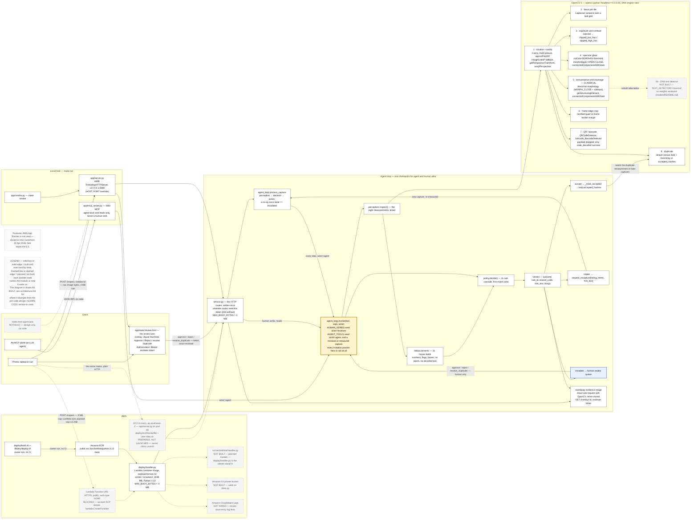

# Second Look — architecture

The diagram the OpenCV AI Competition rules ask for: "An architecture diagram showing the
OpenCV 5 and AWS components and, where relevant, COOL or agent components."

- Source: [`architecture.mmd`](./architecture.mmd) (Mermaid)
- Exported image: [`architecture.svg`](./architecture.svg)

**No AWS COOL service is used by this entry**, so nothing COOL appears on the diagram. The
agent components — the `invoke()` chokepoint, the loop driver, the human review lane — are
drawn in full, because they are the entry's whole claim.

## Legend

**Solid box or solid edge = built and exercised by tests. Dashed box or dashed edge =
planned, not built.** Every dashed node names what it waits on (a planned module, or the
AWS account block), so a reader can tell at a glance what runs today from what is on paper.
The one heavily outlined box, `agent_loop.invoke(tool, args, actor)`, is the single
chokepoint: every arrow from the HTTP routes, from the MCP server, from `process_capture`, and
from the review page's buttons goes *into* it, and none route around it.

## Reading the bands

### Client

A phone, laptop or `curl` posts raw image bytes to `POST /inspect`, and a retake photo to
`POST /retake/:id`. The 4 MB cap is real on every HTTP path: `MAX_BODY_BYTES = 4 * 1024 * 1024`
in `src/secondlook/service.py`, pre-checked from `Content-Length` in `app/server.py`, and a
larger body is rejected with `413 payload_too_large` rather than decoded from a truncated
buffer. An MCP client (an LLM agent) talks JSON-RPC over stdio to `app/mcp_server.py`.

The built UI is the **review lane** — `app/static/review.html`, which shows each escalated
capture's evidence overlay, the clause that fired and its key measurements, and whose Approve,
Reject and duplicate buttons `fetch()` the reviewer routes with the reviewer token. The
pre-code design also sketched an *agent lane* in an `index.html`; that lane is not built, so it
is drawn dashed.

### Local host and AWS — two entry points, one loop

`app/server.py` (stdlib `ThreadingHTTPServer`, `make run`, and the EC2 image) and
`deploy/handler.py` (Lambda Function URL, payload format 2.0) are two adapters over the *same*
routes, `src/secondlook/service.py`, and through them the same `AgentLoop`. Neither has its own
decision logic; each translates its request shape into one `Service.handle(...)` call, and the
routes are `process_capture` or `invoke(...)` calls. The reviewer routes check the reviewer
token before any `invoke()`. `app/mcp_server.py` is a third adapter, for the agent side only.

The Lambda function is a **container image** on **arm64 / Graviton2**, 2048 MB, Python 3.13,
from the `public.ecr.aws/lambda/python:3.13` base, fed in from **Amazon ECR**
by `deploy/build.sh` and `deploy/deploy.sh` — drawn as a hand-run arrow labelled
**"owner-run, no CI"**, because this repo forbids CI and deploying is an owner action.

The Function URL edge itself is **dashed**: the handler code is built and exercised locally
(`deploy/smoke_local.py` calls `handler.handler()` in-process, Docker-free), but the live
endpoint was never created — deployment was attempted and blocked by the only available
AWS account's Free Plan Service Control Policy, not left undone. See
[`deploy.md`](./deploy.md) for the attempt log.

The **EC2** node is dashed too: one `t3.micro` in `ap-southeast-2` running `app/server.py` from
`deploy/ec2/Dockerfile`, built on first boot by `deploy/ec2/user-data.sh`. Every console field
is prepared in [`deploy.md`](./deploy.md#ec2-console-deploy); it becomes solid once the owner
has launched it and its verification output is recorded.

**Amazon S3** and **Amazon CloudWatch Logs** appear dashed: the design calls for a private
bucket behind a `store.py` module and one structured log line per trace entry, and neither is
built. Drawing them solid would claim persistence and observability this entry does not have.

### The chokepoint

`agent_loop.invoke(tool, args, actor)` is the emphasised box. Every agent tool call, every
human verb and every review-page button pass through it. Its first act is the actor guard;
each agent tool then checks the capture's state and refuses anything that is not `received` or
`measured`, so no agent call can move an escalated, waiting or decided capture. Inside it: `perception.inspect()` produces a frozen `Measurements` record (31
fields — numbers, flags, boxes, and provenance; **no pixel data and no decoded text**),
`policy.decide()` walks the 11-rule cascade first-match-wins, and the resulting `Verdict`
selects one of three outcomes — `accept`, `retake`, `escalate`. `overlay.py` draws the
measurements back onto the image for the reviewer, per request, and stores nothing.

### OpenCV 5

`perception.inspect()` expands into the eight measurements, each labelled with the real
OpenCV 5 calls behind it. Rectification runs first and every later measurement reads the
rectified page, which is why blur and glare are reported *by location on the receipt* rather
than as one score for the photograph.

Measurement 5 is marked **CLASSICAL**: `TEXT_DETECTOR = "classical"` in `perception.py`, and
`models/README.md` vendors no weights. The DNN text path the design wanted on the diagram
(`dnn.TextDetectionModel_DB`) is drawn dashed as the unbuilt alternative. `dnn_engine_name()`
still reports OpenCV 5's `new` engine, and that string is recorded in every `Measurements`.

## Where this diverges from the pre-code design

The diagram's node-and-edge list was written before any code existed, as part of the entry's
design notes (not published in this repository). Seven of the things it prescribes differ
from what was built (the evidence overlay has since been built, differently), and drawing
them as designed would have misrepresented the system — which is itself a
stated rejection ground for this competition ("Misrepresents capabilities, results,
benchmarks, or the role of human review"). The diagram above is therefore drawn **as
built**, and the divergences are recorded here rather than hidden:

| The pre-code design says | As built |
|---|---|
| `apply.py` is the single chokepoint | The chokepoint is `agent_loop.invoke(tool, args, actor)`. `apply.py` does not exist. |
| Side arrows to a private **Amazon S3** bucket | Not built (it waits on a `store.py` module) — drawn dashed. |
| Side arrows to **Amazon CloudWatch Logs**, one line per trace entry | Not wired — drawn dashed. The trace exists in memory and over `GET /trace/:id`. |
| Measurement 5 marked `dnn.TextDetectionModel_DB` | The built path is classical morphology; `TEXT_DETECTOR = "classical"`, no weights vendored. The DNN path is drawn dashed. |
| An `index.html` with an **agent lane** and a review lane | Only the review lane exists, as `app/static/review.html`. The agent lane is drawn dashed. |
| An evidence-overlay image on every verdict | Built after submission as `overlay.py`, drawn per request for the reviewer (`GET /overlay/:id`) rather than stored with every verdict. |
| All **six** human-only verbs in the review lane | Three are built (`approve`, `reject`, `resolve_duplicate`), each with an HTTP route and a review-page button; `override`, `discard` and `close_batch` are not, and `agent_loop.py`'s own docstring says so. See [`agent-workflow.md`](./agent-workflow.md). |

Divergences in the other direction: the design drew a single AWS entry point, and the entry as
built has three adapters — the local and EC2 `app/server.py`, the Lambda `deploy/handler.py`,
and the stdio `app/mcp_server.py` — so the diagram carries a local band and an EC2 node the
design did not anticipate. All are adapters over one loop, which is why the chokepoint appears
once and not three times.

**The design sketch is deliberately left unrevised.** It is the record of what was
intended; this file is the record of what was built, and the difference between the two is
stated above rather than quietly edited away.
